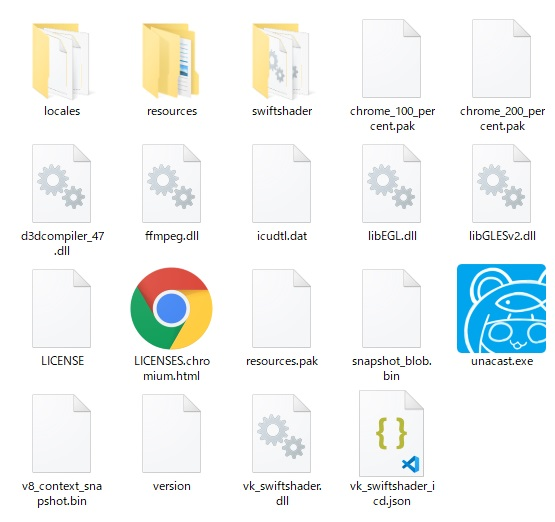
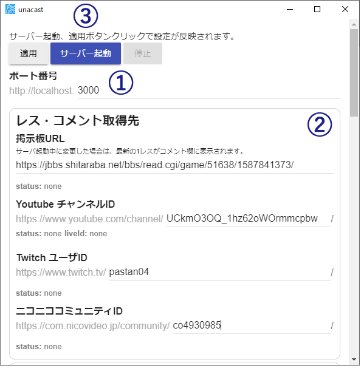
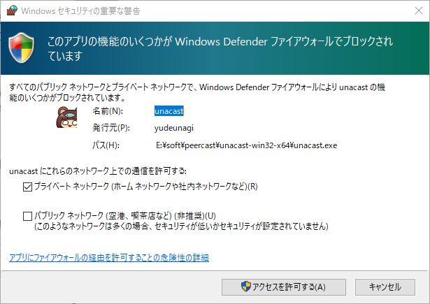
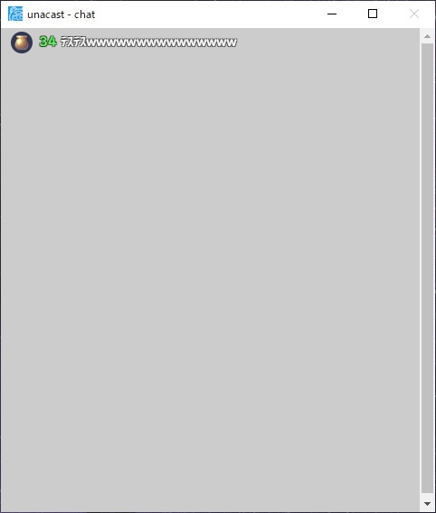
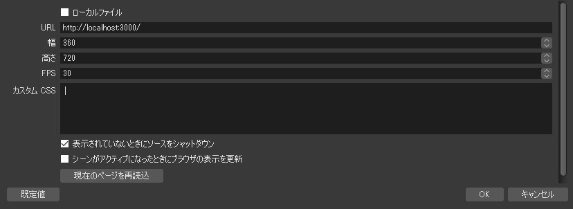
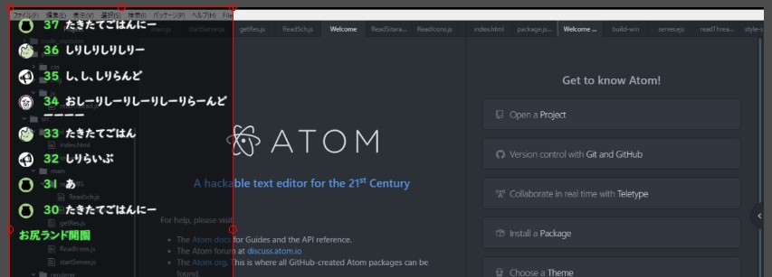
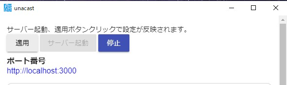

# 基本的な使い方

## 1.ソフト起動

解凍したフォルダ内にある「unacast.exe」を実行してください。

## 2.設定＆サーバー起動

1. ポート番号を設定します（特に理由がなければ3000でOK）
1. 読み込みたい板のURLを入力します（最後は"/"で終わるように）
   - 板以外の情報は必要に応じて入力してください
1. サーバー起動ボタンを押します

サーバー起動時に以下のようなウィンドウが出たらそのまま「アクセスを許可する」を押してください

スレッドが読み込めた場合、chatウィンドウに以下のように表示されます。

chatウィンドウが不要な場合は最小化ボタンをクリックすればOKです。

## 3.OBS取り込み
OBSのソースで「ブラウザソース」を追加し、設定画面を開きます。

1. URLは「`http://localhost:{上で設定したポート番号}/`」と入力してください。
    - 例：`http://localhost:3000/`
1. 幅は配信画面サイズの1/3～1/5ぐらいがおすすめ（サイズが 1280x720 なら 320～420ぐらい）
1. 高さは配信画面サイズと同じかちょっと多いぐらい（サイズが 1280x720 なら 720～ぐらい）
1. FPSは30のままでOK
1. カスタムCSSは削除して空欄にしてください（入力して表示をカスタマイズすることもできます、詳しくは後述）

## 4.取り込みイメージ
正常に動作していれば下記画像のようにレスが表示されます。  

## 5.停止

停止ボタンクリックでレス読み込みが停止します。

## 6.終了

2通りの終了方法があります。
なお、レス読み込みを停止せずに、直接終了することもできます。

1. ウィンドウ右上の×ボタン
1. タスクトレイで右クリックし、`終了`
