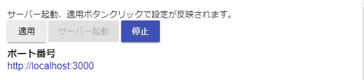
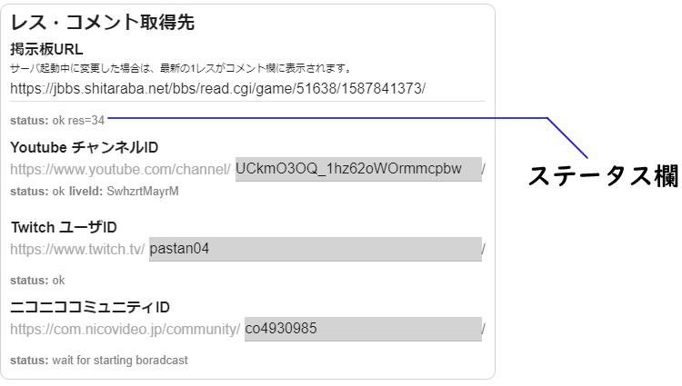
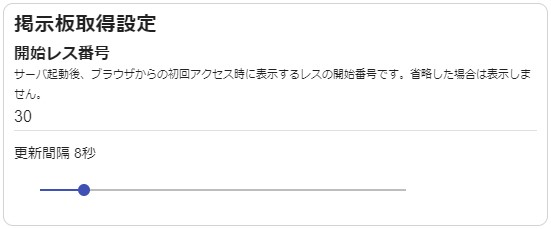
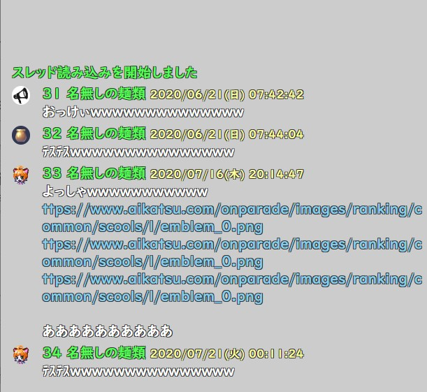
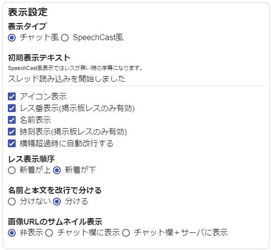
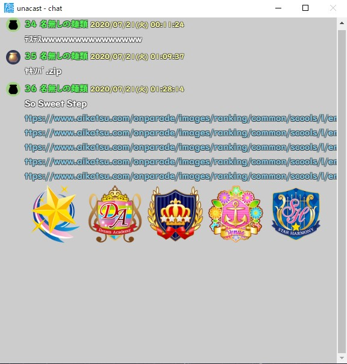
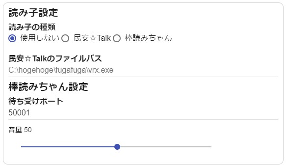
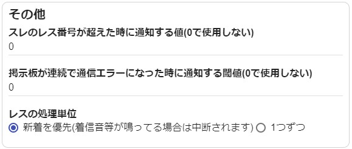
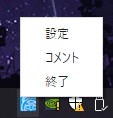

# 詳細な使い方

`基本的な使い方`で解説していない機能について。

## 動作中の設定変更

サーバー起動中、停止せずに一部の設定を変更することができます。
各項目を変更した後、`適用`ボタンをクリックしてください。
掲示板URLを変更した場合、そのスレの最新の1レスだけが追加で表示されます。

## レス・コメント取得先

- ステータス欄

  各取得先に対する読み込み状況や通信状況を表示します。
  表示内容はサービスによって異なります。
  上記画像の例だと以下の通りになります。

    - 掲示板: 通信OK。レス34番まで読み込んだ
    - Youtube: 通信OK。Youtube配信時に払い出されるLiveIDがSwhzrtMayrM
    - Twitch: 通信OK。
    - ニコニコ: 配信開始待ち

## 掲示板取得設定

- 開始レス番号

  その名の通り、掲示板を読み込んだ時に表示する起点のレス番号となります。
  上記の例だと30を指定しているので、30番より後のレスが初期表示となります。

     

- 更新間隔
  掲示板のリロード間隔です。
  各サービスに負荷のかからない範囲で設定してください。

## 表示設定

- 表示タイプ
  - チャット風: 受信した全てのレスを表示します。
    - 画面の高さに入り切らない分は画面外に流れていきます。
  - SpeechCast風: 受信したレスを1つずつ表示・非表示を切り替えていきます。
- 初期表示テキスト
  - 表示タイプによって動作が変わります
    - チャット風: レスの先頭位置にテキストを表示します。レスの受信と共に流れていきます。
    - SpeechCast風: レスが無い間、テキストを表示し続けます。
- アイコン表示
  - レスごとのアイコンを表示します。
- レス番表示
  - レス番号・コメント番号があるサービスについて、番号を表示します。
- 時刻表示
  - レス時刻を表示します。
- 横幅超過時に自動改行する。
  - レスの文量がウィンドウ幅を超過した時、ウィンドウ幅に合わせて文字を折り返します。
- レス表示順序
  - 新着レスを上に積むか、下に積むかを選択します。
- 名前と本文を改行で分ける
  - そのまま。
- 画像URLのサムネイル表示
  - 画像拡張子(png/jpg/gif)のURLが貼られた時、画像をサムネイル表示します。

サムネイル表示がオンの時は、以下のように表示されます。

## レス・コメント着信音設定

着信音のフォルダパスに含まれる`.wav`ファイルをランダムに再生します。

## 読み子設定

受信したレスの本文を各種読み上げソフトに渡します。

## その他

- スレのレス番号が超えた時に通知する値
  - 例えば掲示板のレス数が1000になった時に通知する機能です。その場合は`1000`を入力してください。
  - `0`を入力した場合は通知を行いません。

- 掲示板が連続で通信エラーになった時に通知する閾値
  - 項目名の通り。

- レスの処理単位
  - 複数のレス、コメントを一気に受信した時に、まとめて表示するか、一つずつ表示するかを選択します。
  - 主に表示タイプ`SpeechCast風`で活きる設定です。

---

## タスクトレイ

- 左クリック
  - chatウィンドウにフォーカス
- 左ダブルクリック
  - 設定ウィンドウにフォーカス
- 右クリック
  - 設定: 設定ウィンドウにフォーカス
  - コメント: chatウィンドウにフォーカス
  - 終了: このアプリケーションを終了
